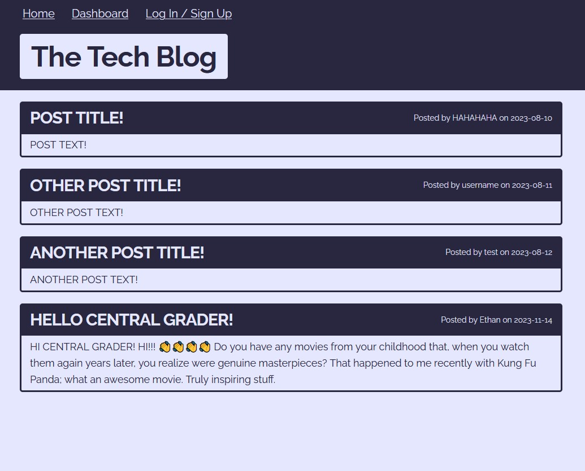

# Module 14 Weekly Challenge - Tech Blog 

## Description

While your time working as a web developer will be spent - big surprise - developing websites, it's also important to keep on top of the latest news, trends, and technologies. To that end, this Tech Blog provides a hub for like-minded individuals to discuss said news, trends, and technologies.

## Usage

Visit the Tech Blog here;

https://calm-ocean-31747-c91718f6c844.herokuapp.com/

Upon opening the page, you will be met with the blog's home page, listing all the blog's posts, and a header, containing several links for site navigation. Click the Log In / Sign Up link to navigate to the login / signup page, where you can create an account. After creating an account, you will now be able to comment on blog posts, and access the dashboard page. From the dashboard page, you can create new posts, or edit / delete any existing posts you've made. After logging in, the Log In / Sign Up link will be replace by a Log Out link, which you can use to sign out of your account. Note that you will be automatically signed out after one hour.

## Installation

To run the application locally, begin by installing the repository files & extract them to a dedicated folder.

Navigate to the folder, rename the ".env.EXAMPLE" file to ".env", and fill in the empty strings with the appropriate details. SESSION_SECRET should contain any secure string of your choice, DB_USER should contain your MySQL username, DB_PASSWORD your password, and DB_NAME the name of the database to use - in this case, it is already filled in for you; "tech_blog_db".

Navigate to the repository a git bash shell (or equivalent), and type "npm install" to install the application's dependencies. Next, initiate the MySQL CLI & run the command "source ./db/schema.sql" to initialize the database. Finally, return to the shell and type "node server.js" or "npm start" to start the application. If you want to seed the database with some sample information, then you type "npm run seed" before starting the server.

Next, open up a web browser and navigate to "http://localhost:3001/", where you should now find the home page of the application.

## Preview

## Credits

MIT License Badge (./README.md, line 1);
https://gist.github.com/lukas-h/2a5d00690736b4c3a7ba

normalize.css file (./public/css/normalize.css);
https://github.com/necolas/normalize.css

skeleton.css file (./public/css/skeleton.css);
http://getskeleton.com/

Error Modal Setup;
https://www.w3schools.com/howto/howto_css_modals.asp

Miscellaneous Code Structure;
https://github.com/UofTTeam2/TravIS

## License

Operates under a standard MIT license. For more information, refer to the LICENSE file in the repository, or visit the following website; https://opensource.org/licenses/MIT.